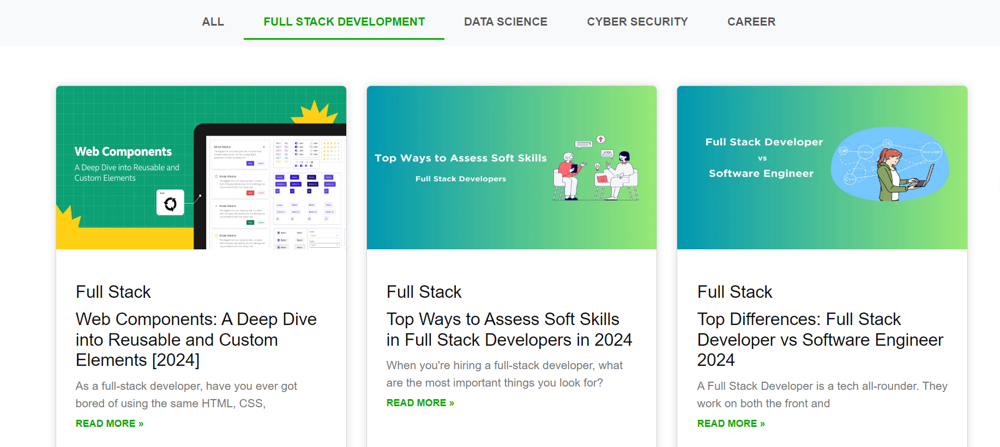

# 🚀 React Blog App

**This is a simple React blog application that displays articles categorized into different topics such as Data Science, Full Stack Development, Cyber Security, and Career.**

## 📋 Table of Contents

- [🚀 React Blog App](#-react-blog-app)
  - [📋 Table of Contents](#-table-of-contents)
  - [📂 Folder Structure](#-folder-structure)
  - [🖼️ Sample Image](#-sample-image)
  - [🌐 Deployment](#-deployment)
  - [🤝 Contributing](#-contributing)

## 📂 Folder Structure

- The project structure is organized as follows:
- src/: Source code for the React application.
- components/: React components for different sections.
- App.js: Main application component.
- index.js: Entry point for the React app.
- public/: Public assets and HTML template.
- Components
  _ Navbartask.js: Navigation bar component.
  _ All.js, Fullstack.js, Datascience.js, Cyber.js, Career.js: Components for displaying articles based on categories. \* Card.js: Component for rendering individual article cards.
- Styles \* App.css: Styles for the application.

## 🖼️ Sample Image

## 🌐 Deployment

The application is deployed and can be accessed here: .

## 🤝 Contributing

- Contributions are welcome! If you find any issues or have improvements, feel free to create a pull request.
# react-router-task
